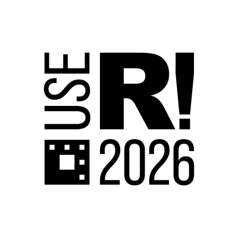
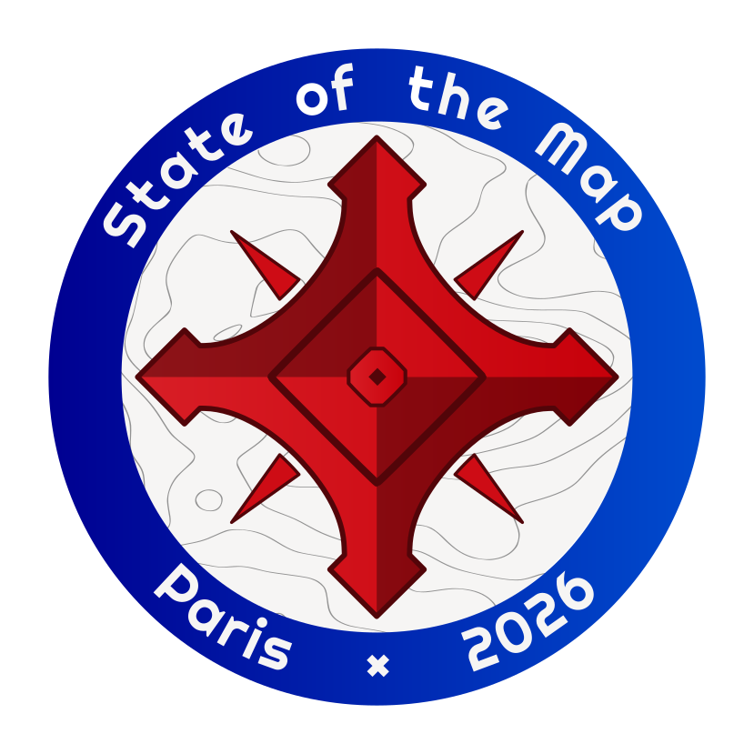
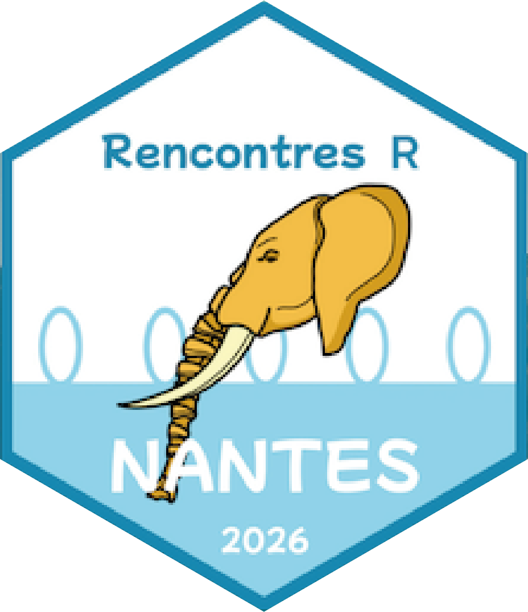
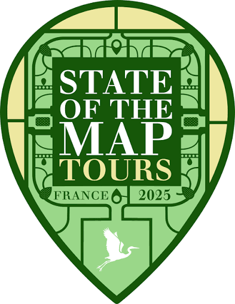
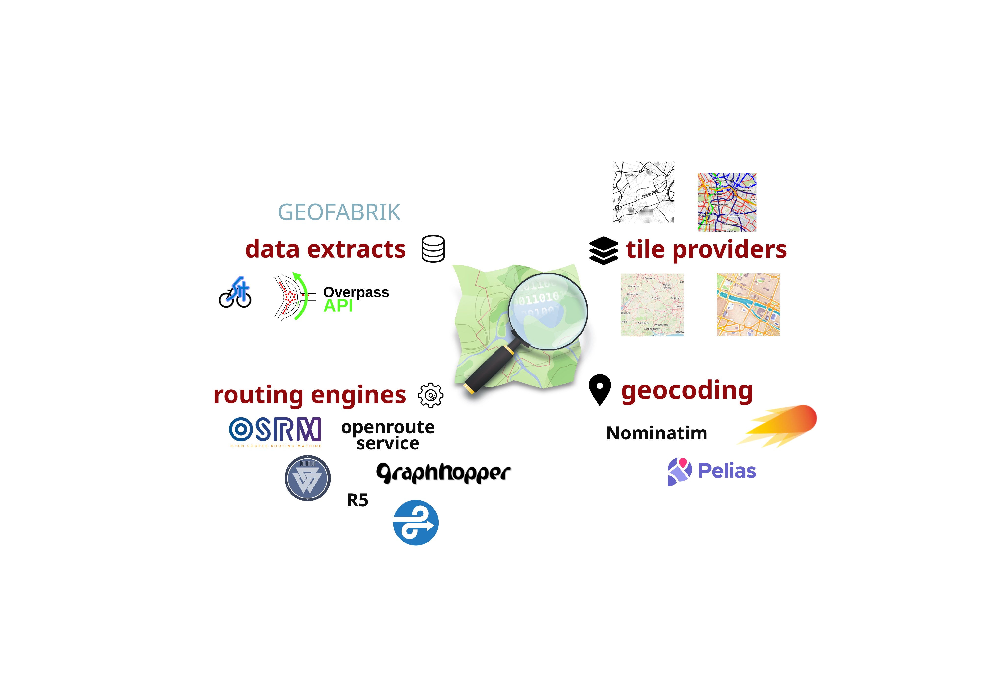
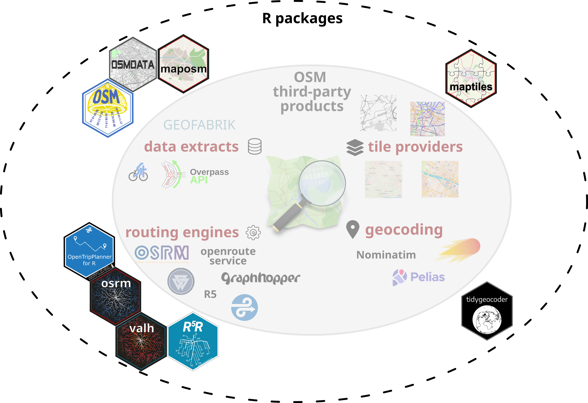

## Introduction

::: {.incremental}
- The R Software
- R and OSM
- Reproducible Example
:::


:::{.notes}
In this talk we will talk about how it is possible to use OSM data and related from the statistical software R. 

We have to explain our positionning first. We work for a research laboratory in CNRS. 
We use OSM data as input for scientific studies. 
For exemple we have work on interactions across French borders. 
We have also work intensively on accessibility to rural areas at european scale.

Doing so we use OSM data as is, as a primary source of raw data.
So we do not contribute in anyway to the OSM data base (in the time spend at the office). 

In order to use the data and tool in a profesional way we use a specific software (and language) made for and by researchers: the R software. 
To respond to some specific needs we had to extend the R software package ecosystem. 
We have developped some R package to interact with the OSM DB or some 3rd party tools. 

In this talk we'll start by introducing you to the R Software and its specificities, 
we'll then present an opiniated list of OSM related R packages, 
we'll finish with a comprehensive exemple that demonstrate how to use these package. 

:::
    
# R

## The R Software

{width="150px" fig-align="center"}  

- Free and open source software (GNU GPLv3)
- Work most OS 
- Geared towards reproducible research
- Unified workflows (Rstudio)

:::{.notes}
R stands out as a free and open source programming 
language and software for statistical computing and data visualization. 

Complemented by more than 23,500 user-contributed packages hosted on the Comprehensive R Archive Network in 2026.

The language’s versatility allows users to build unified workflows within an environment conducive to reproducible research. 

R is widely used for research purposes in many fields beyond statistics, such as biology, social sciences, or geomatics.
:::

## The R Software Spatial Ecosystem

::: columns
::: {.column width="50%"}
#### Vector Data Handling
`sf` [@R-sf]  
{width="125px"}

**Main features**

* import / export
* display
* geoprocessing
* support for unprojected data
* use of the [*simple feature* standard](https://en.wikipedia.org/wiki/Simple_Features)
:::

::: {.column width="50%"}

#### Raster Data Handling

`terra` [@R-terra]  
{width="115px"}

**Main features**

- import / export
- display 
- study area modifications 
- spatial algebra 
- transformation and conversion
:::
:::

:::{.notes}
A subset of R packages forms a robust and mature spatial ecosystem that makes it easy to handle and display spatial data.

The 2 main packages used to deal with spatial data are sf and terra. 
Both are base on GDAL, PROJ and PROJ to handle data import, projections and geoprocessing

:::


## The R Software Spatial Ecosystem


::: columns
::: {.column width="50%"}
#### Thematic Cartography
`mapsf` [@R-mapsf]  
{width="115px"}  
`tmap` [@R-tmap]  
{width="115px"}   
`ggplot2` + `ggspatial` [@R-ggspatial]
{width="115px"} 


:::

::: {.column width="50%"}

####  Spatial analysis / spatial statistics
- `spatstat` : Point pattern analysis
- `gstat` : Variograms and Krigeage
- `rgeoda` : Geoda with R
- `GWmodel`, `spgwr` : Geographically Weighted Models

::: {.callout-tip title="[CRAN Task View: Analysis of Spatial Data](https://cran.r-project.org/web/views/Spatial.html)"}
* Spatial sampling
* Point pattern analysis
* Geostatistics
* Disease mapping and areal data analysis
* Spatial regression
* Ecological analysis
:::
:::

:::

:::{.notes}
To complement this overview on the spatial ecosystem of the R software we can have a look at some 
package for thematic cartograhy.   
mapsf is developped in our lab. It aims at creating thematic or statistitcal maps. 
tmap is an alternative to mapsf that use a different syntax, close to the one of the ggplot2 package that also allow to crate thematic maps. 

At last, as a statistical programming language, R allows to use a lot of spatial analysis or spatial statistic computations. You have only a short overview of it. 

:::


# R and OSM

---

::: columns

::: {.column width="50%"}

#### R

A community...

{width="100px"}

:::

::: {.column width="50%"}

#### OSM

<br>

{width="100px"}

:::

:::

... that organises annual meetings...

::: columns

::: {.column width="50%"}

{width="120px"}

:::

::: {.column width="50%"}

{width="110px"}

:::

:::

... with local subgroups

::: columns

::: {.column width="50%"}

{width="100px"}

:::

::: {.column width="50%"}

{width="100px"}

:::

:::


:::{.notes}
R provides seamless access to various APIs 
and tools for downloading and filtering OpenStreetMap data, querying shortest 
routes and itineraries, or generating both static and interactive maps.
:::

## How does it work ?

{fig-align="center"}


## Overview

{fig-align="center"}

## Overview

{fig-align="center"}


## Access to the database

::: columns
::: {.column width="50%"}

#### Find OSM data

- [Geofabrik download server](https://www.geofabrik.de/data/download.html)

- [BBBike](https://extract.bbbike.org/)

- [Overpass API](https://wiki.openstreetmap.org/wiki/Overpass_API)

:::

::: {.column width="50%"}

#### R packages

- `osmextract` [@R-osmextract], import datasets from both Geofabrik and BBBike

- `osmdata` [@R-osmdata], downloads OSM data from the Overpass API

:::

:::

:::{.notes}
We begin with packages that download and extract data, such as `osmextract` and `osmdata`
:::

## Geocoding and Routing

::: columns
::: {.column width="50%"}

#### Routing engines

- [OSRM](https://project-osrm.org/)

- [Valhalla](https://valhalla.github.io/valhalla/)

- [R5](https://github.com/conveyal/r5)

- [OpenTripPlanner](https://www.opentripplanner.org/)

- [Openrouteservice](https://openrouteservice.org/)

- [GraphHopper](https://www.graphhopper.com/)

<br>

#### Geocoding tools

- [Nominatim](https://nominatim.org/)

- [Photon](https://photon.komoot.io/)

- [Pelias](https://pelias.io/)


:::

::: {.column width="50%"}

#### R packages

- `osrm` [@R-osrm], very fast (pre-processed routes)

- `valh` [@R-valh], based on tiles

- `r5r` [@R-r5r], allows multimodal routing (GTFS tables)

- `opentripplanner` [@R-opentripplanner], integrated web server

<br><br>

- `tidygeocoder` [@R-tidygeocoder], based on Nominatim API

:::

:::

:::{.notes}
we explore solutions that interface third party softwares for geocoding (Nominatim with `tidygeocoder`) 
and routing (OSRM with `osrm`, Valhalla with `valh`)
:::

## Cartography

::: columns
::: {.column width="50%"}

#### OSM layers

- [Tile providers](https://wiki.openstreetmap.org/wiki/Raster_tile_providers)

:::

::: {.column width="50%"}

#### R packages

- `leaflet` [@R-leaflet] and `mapview` [@R-mapview], dynamic cartography (OSM background)

- `maptiles` [@R-maptiles], downloads raster tiles

- `maposm` (not on CRAN), downloads vector objects (Overpass API)

:::

:::

:::{.notes}
we address dynamic cartography (using `leaflet`) and 
creation of static maps from raster tiles (using `maptiles`) or 
from vector objects (using `maposm`)
:::

# Reproducible Example

:::{.notes}
To illustrate the practical application of these tools, we conclude with a short, 
seamless and fully reproducible example. From the geocoding of an address, 
to the extraction of amenities or the use of routing engines and till the creation 
of a publication-ready map, we propose a complete workflow that harness the power 
of R ecosystem to create insightful analysis from OpenStreetMap data.
:::

## Geocoding - Retrieve coordinates from an address

```{r geocode}
#| code-line-numbers: "5"
library(sf) # for spatial data processing
library(tidygeocoder) # geocoding

# SOTM 2026 address
pt <- geo(address = "6 Av. Blaise Pascal, 77420 Champs-sur-Marne", method = "osm")
# Transform dataframe with X/Y coords to an sf object
(pt <- st_as_sf(pt, coords = c("long", "lat"), crs = 4326))
```

## Interactive map with OSM background layer

```{r display_geocode}
#| code-line-numbers: "2"
#| cache: false
library(mapview)
mapview(pt)
```


## Tiles extraction - Raster format

```{r maptiles}
#| code-line-numbers: "3,5,6"
#| eval: false
library(maptiles)
# Define a bounding box around our address
bbox <- st_bbox(st_buffer(pt, 500))
# Download tiles covering the bounding box
tiles <- get_tiles(x = bbox, project = FALSE, provider = "CartoDB.Positron",
                   zoom = 16, crop = TRUE)
tiles
```

```{r maptiles_cache}
#| echo: false
#| cache: false
library(maptiles)
tiles <- terra::rast("data/tiles.tif")
tiles
```


## Plot tiles - Raster format

```{r map_maptiles}
#| code-line-numbers: "2-5"
#| fig-width: 7
#| fig-height: 7.294
library(mapsf)
pt <- st_transform(pt, 3857)
mf_raster(tiles)
mf_map(pt, col = "darkgreen", cex = 3, add = TRUE)
mf_credits(maptiles::get_credit("CartoDB.Positron"))
mf_title("SOTM 2026")
```


## Download OSM data - from Overpass API

```{r osmdata}
#| code-line-numbers: "2-6"
#| eval: false
library(osmdata)
poi <- bbox |> 
  opq(osm_types = "node") |>
  add_osm_feature(key = 'amenity', value = "post_office") |>
  osmdata_sf()
po <- poi$osm_points
flextable::flextable(po, col_keys = names(po))
```


```{r osmdata_cache}
#| echo: false
po <- readRDS("data/poi.rds")
flextable::flextable(po, col_keys = names(po))
```


## Download OSM data - from Overpass API

```{r map_osmdata}
#| fig-width: 7
#| fig-height: 7.294
#| code-line-numbers: "1,4"
po <- st_transform(po[1,], 3857)
mf_raster(tiles)
mf_map(pt, col = "darkgreen", cex = 3, add = TRUE)
mf_map(po, col = "gold1", cex = 3, add = TRUE)
mf_credits(maptiles::get_credit("CartoDB.Positron"))
mf_title("SOTM 2026 conference and a post office")
```


## Routing - interface OSRM and Valhalla APIs

```{r routing}
#| code-line-numbers: "4,5"
#| eval: false
library(osrm)
library(valh)
# Shortest route from the address to the first post office
road_o <- osrmRoute(src = pt, dst = po, osrm.profile = "bike")
road_v <- vl_route(src = pt, dst = po, costing = "bicycle")
road_o
road_v
```


```{r routing_cache}
#| echo: false
road_o <- readRDS("data/road_o.rds")
road_v <- readRDS("data/road_v.rds")
(road_o)
(road_v)
```


## Map the results


::: {.column}
```{r map}
#| fig-width: 7
#| fig-height: 7.294
#| eval: false
road_o <- st_transform(road_o, 3857)
road_v <- st_transform(road_v, 3857)
mf_raster(tiles)
mf_map(road_o, col = "darkblue", lwd = 4, add = TRUE)
mf_map(road_v, col = "darkred", lwd = 4, add = TRUE)
mf_map(pt, col = "darkgreen", cex = 3, add = TRUE)
mf_map(po, col = "gold1", cex = 3, add = TRUE)
mf_title("Send a letter from SOTM 2026")
mf_scale(100, scale_units = "m")
mf_credits(txt = "© OpenStreetMap contributors © CARTO")
mf_legend(type = "typo_line", val = c("OSRM", "Valhalla"),
          pal = c("darkblue", "darkred"), pos = "topright",
          lwd = 4, val_cex = .8, title = NA)
mf_text(x = pt, txt = "Conference", pos = "bottom", offset = 2)
mf_text(x = po, txt = "Post office", pos = "right")
```
:::

::: {.column}
```{r map}
#| fig-width: 7
#| fig-height: 7.294
#| echo: false

```
:::

# And now for the reproducibility...

## Throwback to last year

```{r}
#| code-line-numbers: "2,3"
# SOTM 2025 address
pt <- geo(address = "GT-Toyota Asian Center Auditorium, Magsaysay Avenue",
          method = "osm")
# Transform dataframe with X/Y coords to an sf object
(pt <- st_as_sf(pt, coords = c("long", "lat"), crs = 4326))
```

---

```{r}
mapview(pt)
```

## Tiles extraction - Raster format

```{r maptiles2}
#| eval: false
bbox <- st_bbox(st_buffer(pt, 500))
tiles2 <- get_tiles(x = bbox, project = FALSE, provider = "CartoDB.Positron",
                   zoom = 16, crop = TRUE)
tiles2
```

```{r maptiles_cache2}
#| echo: false
#| cache: false
tiles2 <- terra::rast("data/tiles2.tif")
tiles2
```


## Plot tiles - Raster format


```{r map_maptiles2}
#| fig-width: 7
#| fig-height: 7.294
#| eval: false
pt <- st_transform(pt, 3857)
mf_raster(tiles2)
mf_map(pt, col = "darkgreen", cex = 3, add = TRUE)
mf_credits(maptiles::get_credit("CartoDB.Positron"))
mf_title("SOTM 2025")
```


## Download OSM data - from Overpass API

```{r osmdata2}
#| eval: false
poi <- bbox |> 
  opq(osm_types = "node") |>
  add_osm_feature(key = 'amenity', value = "post_office") |>
  osmdata_sf()
po <- poi$osm_points
flextable::flextable(po, col_keys = names(po))
```


```{r osmdata_cache2}
#| echo: false
po <- readRDS("data/poi2.rds")
flextable::flextable(po, col_keys = names(po))
```


## Download OSM data - from Overpass API


```{r map_osmdata2}
#| fig-width: 7
#| fig-height: 7.294
po <- st_transform(po[1,], 3857)
mf_raster(tiles2)
mf_map(pt, col = "darkgreen", cex = 3, add = TRUE)
mf_map(po, col = "gold1", cex = 3, add = TRUE)
mf_credits(maptiles::get_credit("CartoDB.Positron"))
mf_title("SOTM 2025 conference and a post office")
```


## Routing - interface OSRM and Valhalla APIs

```{r routing2}
#| eval: false
# Shortest route from the address to the first post office
road_o <- osrmRoute(src = pt, dst = po, osrm.profile = "bike")
road_v <- vl_route(src = pt, dst = po, costing = "bicycle")
road_o
road_v
```


```{r routing_cache2}
#| echo: false
road_o <- readRDS("data/road_o2.rds")
road_v <- readRDS("data/road_v2.rds")
(road_o)
(road_v)
```


## Map the results


::: {.column}
```{r map2}
#| fig-width: 7
#| fig-height: 7.294
#| eval: false
road_o <- st_transform(road_o, 3857)
road_v <- st_transform(road_v, 3857)
mf_raster(tiles2)
mf_map(road_o, col = "darkblue", lwd = 4, add = TRUE)
mf_map(road_v, col = "darkred", lwd = 4, add = TRUE)
mf_map(pt, col = "darkgreen", cex = 3, add = TRUE)
mf_map(po, col = "gold1", cex = 3, add = TRUE)
mf_title("Send a letter from SOTM 2025")
mf_scale(100, scale_units = "m")
mf_credits(txt = "© OpenStreetMap contributors © CARTO")
mf_legend(type = "typo_line", val = c("OSRM", "Valhalla"),
          pal = c("darkblue", "darkred"), pos = "topright",
          lwd = 4, val_cex = .8, title = NA)
mf_text(x = pt, txt = "Home", pos = "bottom", offset = 2)
mf_text(x = po, txt = "Post\nOffice", pos = "topright")
```
:::

::: {.column}
```{r map2}
#| fig-width: 7
#| fig-height: 7.294
#| echo: false

```
:::


# Bonus

## Using OSM with R, the cheat sheet

::: {.column width="50%"}

:::
::: {.column width="50%"}

:::

:::{.notes}
Cheat sheets are a common documentation format for R packages. 
We've built this cheat sheet to give and overview of what is possible to do with OSM from R. 
The first page describes the main functions of the main packages related to OSM. 
Packages are organised by theme.
:::


## Using OSM with R, the cheat sheet

You can download the cheat sheet using the QR code:   


https://zenodo.org/records/20842874


:::{.notes}
The cheat sheet is hosted on Zenodo, you can use the following QR code to access the page or use the link.
:::


## Thank you

You can access the slides using the QR code:   
{fig-align="left" width=444px}

https://riatecom.github.io/R_OSM_SOTM_2026/  


{fig-align="right"}

:::{.notes}
You can access the slides using the QR code or with the link on screen.
:::


## References
